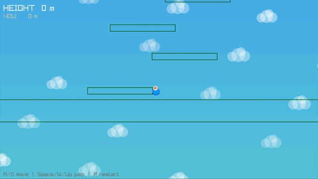

# box_2d

메이플스토리가 **2D 기반의 움직임·맵 구조·점프와 발판** 같은 감각이 강한 게임이라는 점에서, “엔진 이름을 내세우는 것”보다 **2D 물리가 플레이 경험에 주는 손맛**을 직접 만들어 보고 싶어 이 저장소를 정리했습니다.

예선용 프로토타입 **Bouncy Climb**는 C++와 [raylib](https://www.raylib.com/)으로 **중력·충돌·탄성**을 코드로 짜 보며, 작은 화면 안에서라도 “밀고 당기는” 재미가 어떻게 느껴지는지 실험한 결과물입니다.

## 이 저장소로 말하고 싶은 것

- **포트폴리오 보조 증거**  
  “게임을 좋아합니다”보다, **2D에서 물리 요소가 재미에 어떻게 기여하는지**를 한 번 끝까지 구현해 본 흔적에 가깝게 쓰고 싶었습니다.

- **아이디어 확장용 훅**  
  메커톤에서는 플레이어가 단순히 몬스터만 잡는 구조에 그치지 않고, **발판·중력·충돌·탄성** 같은 2D 물리를 활용한 **협동·퍼즐·공략**이 한 월드 안에서 이어지는 경험을 만들어 보고 싶습니다.

- **기존 관심사와의 연결**  
  레이드·경제·협동 루프처럼 **멀티·시스템** 쪽을 다뤄 왔다면, 이 프로젝트는 그 위에 **플레이어가 손으로 직접 조작하며 느끼는 2D 상호작용**에 관심을 넓혀 본 축입니다.

메커톤에서 어필하고 싶은 방향은 **“특정 물리 엔진 전문가”** 이미지가 아니라, **메이플식 성장·협동·레이드 감성에 2D 물리 퍼즐·상호작용을 섞어 새로운 플레이 경험을 설계하고 싶다**는 쪽에 가깝습니다.

> 메이플스토리는 2D 기반의 움직임과 맵 구조가 강한 게임이라고 생각합니다. 그래서 최근에는 C++와 raylib으로 간단한 2D 물리 플랫폼을 만들어 보며, 충돌·중력·탄성 같은 요소가 플레이 경험에 어떤 영향을 주는지 실험해 보았습니다. 메커톤에서는 이러한 관심을 바탕으로, 단순 전투뿐 아니라 **물리 기반 상호작용과 협동 구조가 결합된** 플레이 경험을 만들어 보고 싶습니다.

## 데모



게임 코드: [`mackathon_qualifier/`](mackathon_qualifier/)

## 빌드 (macOS)

저장소 루트에서:

```bash
./premake5.osx gmake2
make -C mackathon_qualifier config=release_x64
```

실행 파일:

`mackathon_qualifier/_bin/Release/mackathon_qualifier`

## 빌드 (Linux)

```bash
./premake5 gmake2
make -C mackathon_qualifier config=release_x64
```

## 빌드 (Windows)

`premake5.exe`로 Visual Studio / Makefile 생성 후 `mackathon_qualifier` 프로젝트를 빌드하세요.

## 라이선스

루트의 `LICENSE`는 원본 예제 레포에서 가져온 항목입니다. raylib은 [Zlib](https://github.com/raysan5/raylib/blob/master/LICENSE) 라이선스를 따릅니다.
